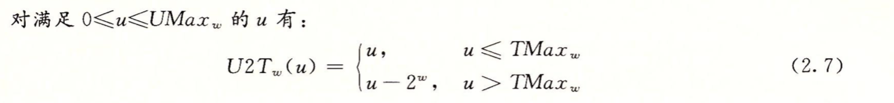
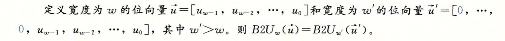
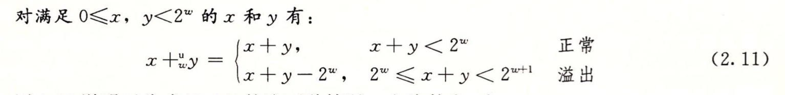
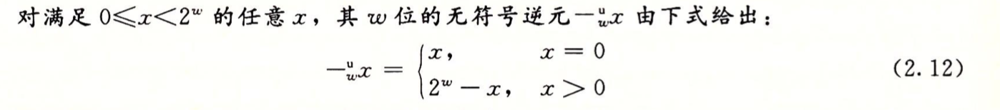
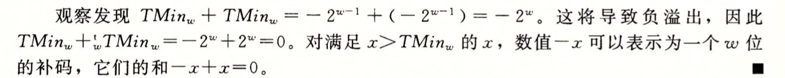

# 第2章: 信息的表示和处理

## 2.1 信息储存
字节 (byte): 8位的块, 最小的可寻址的内存单位.每次寻址至少是一个字节, 多则4个字节, 8个字节等.

虚拟内存(virtual memory): 机器级程序将内存视为一个非常大的字节数组, 这就叫做虚拟内存.(内存本身不是字节数组, 所以这个非常大的字节数组被称为虚拟的.)

地址 (address): 内存的每个字节都由一个唯一的数字来标识, 称为地址.

虚拟地址空间 (virtual address space): 所有的地址 (address) 的集合就称为 虚拟地址空间.

程序对象 (program object): 程序数据, 指令和控制信息.


## 2.1.1 十六进制表示法

十六进制数 (hexadecimal): 以 16 为基数, 满16进1. 因为二进制太冗长, 十进制与位模式的互相转换太麻烦, 所以用Hex. 0~9 A~F, 以 0X 或 0x 开头的数字.

练习题:

A. 将 0x39A7F8 转换为二进制    
B. 将二进制 1100100101111011 转换为十六进制.  
C. 将 0xD5E4C 转换为二进制.  
D. 将二进制 1001101110011110110101 转换为十六机制.  

解:    
A. 0x39A7F8 -> 0011 1001 1010 0111 1111 1000   
B. 1100 1001 0111 1011 -> 0xC97B  
C. 0xD5E4C -> 1101 0101 1110 0100 1100  
D. 10 0110 1110 0111 1011 0101 -> 0x26E7B5


当值 _x_ 是 2 的非负整数 _n_ 次幂时, 可以写成 n = i + 4j 的形式, 0 ≤ i ≤ 3, 可以把 _x_ 写成开头为16进制数: 1(i=0), 2(i=1), 4(i=2), 8(i=3), 后面跟着 _j_ 十六进制的0. 比如: _x_ = 2048 = 2<sup>11</sup>, n = 11 = 3 + 4 · 2. 从而得到十六进制: 0x800.
> 个人理解: 因为十六进制的1位需要用4位二进制来表示. 所以当 _j_ 为 1 的时候, 意味着有4个0, j 为 2的时候, 有8个0, i 只有4种情况, 0001, 0010, 0100, 1000, 分别对应了, 1, 2, 4, 8, 所以, i 只能取 0 到 3 之间. 因为 2<sup>0-3</sup> = [1, 2, 4, 8].  大致就是这个原理.


## 2.1.2 字数据大小
字长 (word size): 指明指针数据的标称大小( nominal size ), 虚拟地址以字长来编码, 所以字长决定的最重要的系统参数就是虚拟地址空间的最大大小. 也就是说对于一个字长为 w 位的机器而言, 虚拟地址的范围为 0~2<sup>w</sup>-1, 程序最多访问 2<sup>w</sup> 个字节.
> 32位字长限制虚地址空间为4千兆字节(4GB),扩展到64位字长, 虚拟空间地址为 16EB (1EB = 1024PB, 1PB = 1024TB)这里涉及到操作系统的内存管理...


为了避免因为机器的不同而导致数据类型的大小不一, C99引入了 int32_t & int64_t 来精确控制数据的大小.

一般的数据类型编码都是有符号数值, 除非前面有 unsigned 关键字来特别声明无符号.

char类型,大多数编译器和机器视为有符号数, 但C标准不保证这一点.

## 2.1.3 寻址和字节顺序

一个 _w_ 位的整数, 其位表示为  [_x_<sub>w-1</sub>, _x_<sub>w-2</sub>,..._x_<sub>1</sub>, _x_<sub>0</sub>], 其中 _x_<sub>w-1</sub> 是高有效位, 而 _x_<sub>0</sub> 是低有效位, 假设 _w_ 是 8 的倍数, 这些位就能被分组成为字节, 其中最高有效字节包含位 [_x_<sub>w-1</sub>, _x_<sub>w-2</sub>,..._x_<sub>w-7</sub>, _x_<sub>w-8</sub>], 而最低有效字节包含[_x_<sub>7</sub>, _x_<sub>6</sub>,..._x_<sub>1</sub>, _x_<sub>0</sub>].  

机器在内存中按照从最低有效字节到最高有效字节排序, 有些则反之.  

小端法 (little endian): 最低有效字节在最前面的方式. 

大端法 (big endian) : 最高有效字节在最前面.

假设 x 的类型为 int, 首地址位 0x100, 十六进制为 0x01234567.  

大端法: 0x100 -> 01, 0x101 -> 23, 0x102 -> 45, 0x103 -> 57

小端法: 0x100 -> 67, 0x101 -> 45, 0x102 -> 23, 0x104 -> 01.

Android & iOS 都是小端法.

当阅读汇编的字节级表示的时候, 大端和小端的排序就显得比较重要了, 这决定了你怎样来读取指令.

## 2.1.4 表示字符串
C 语言的字符串被编码为一个以 null (值为0) 字符结尾的字符数组.

每个字符都以某个标准码来表示,最常见的是 ASCII 码, (Mac 终端可以用 `man ascii` 命令来打印出 ASCII 码的列表)

`show_bytes("12345", 6);` 来运行的话,得到的结果为: 31 32 33 34 35 00, 这里的12345正好对应ASCII的31 32 33 34 35.

在使用 ASCII 的系统上, 上面的函数调用的到的结果,都是相同的, 与字节的顺序和大小规则无关, 所以, 文本数据比二进制数据具有更强的平台独立性.

## 2.1.5 表示代码

不同的机器类型使用不同的且不兼容的指令和编码方式. 即使完全一样的进程, 运行在不同的操作系统上也会有不同的编码规则, 因此二进制代码是不兼容的.

从机器角度来看, 程序仅仅只是字节序列.

## 2.1.6 布尔代数简介


~ : 逻辑运算 NOT.  
& : 逻辑运算 AND.  
| : 逻辑运算 OR.  
^ : 逻辑运算 ⊕, 当 P 或者 Q 为真但不同时为真时, P ⊕ Q 成立. P = 1  且 Q = 0 或者 P = 0 且 Q = 1, P^Q = 1.

可以用位向量 [_a_<sub>w-1</sub>, _a_<sub>w-2</sub>,..._a_<sub>1</sub>, _a_<sub>0</sub>]编码任何子集 A⊆{0, 1, ..., w-1}.
比如: a ≐ [0110 1001] 表示集合 A = {0, 3, 5, 6}, 而 B≐[0101 0101], 表示集合B={0, 2, 4, 6}.

布尔运算 | 和 & 分别对应集合的并和交, 而 ~ 对应于集合和补.  
运算 a & b 得到位向量 [0100 0001], 而 A ∩ B = {0, 6}.

## 2.1.7 C 语言中的位级运算
C语言支持按位进行布尔运算, 这些运算符号有: `|`, `&`, `~`, `^`.

例如: ~0x41 => ~[0100 0001] => [1011 1110] => 0xBE

### 位级运算的常见用法-- 掩码.
将 0xFF 作为掩码, 将会生成一个由 x 的最低8位有效位的数值.

例如: 0x987654EF & 0xFF => 0x000000EF.

~0 可以生成一个全1的掩码, 不管机器的字的大小.

取补的时候, 进行 x ^ ~0, ~0 生成一个二进制全 1 的数值. 对 1 进行位异或运算, 就是取反.

可以通过 `&`, `~`, `|` 来实现 ^ 操作.

`x ^ y = (x & ~y) | (~x & y);`

## 2.1.8 C 语言中的逻辑运算.

逻辑运算符: `||`, `&&`, `!`. 逻辑运算认为所有非零的参数都表示 TRUE, 而参数 0 表示 FALSE.

逻辑运算符 `||`, `&&`,如果对第一个参数求值就能确定表达式的结果. 就不会对第二个参数进行求值.因此例如: a && 5 / a 将不会造成被 零 除

p && \*p++ 也不会导致间接引用空指针. 因为如果 p 是空指针的话, p 即决定了该表达式的值为 FALSE, 所以就不会去执行 *p, 就避免了对空指针的访问了.

使用位级和逻辑运算来实现 x == y. : !(x^y), 当且仅当 x 的每一位和 y 的每一位匹配时, x ^ y 等于零.

## 2.1.9 C 语言中的移位运算.
移位运算, 向左或者向右.

机器支持两种形式的右移: 逻辑右移和算术右移

逻辑右移, 左侧补0

算术右移, 左侧补最高有效位.

几乎所有的编译器都对有符号的数使用算术右移. 对无符号数必须使用逻辑右移.

> 如果移位量 k 大于数据本身位数 w, (32位数, 移位量40), 那么会移位量为: k mod w.


## 2.2 整数表示.
## 2.2.1 整数数据类型
有符号数的负数范围要比正数的范围大1.

Java 只支持有符号数.

## 2.2.2 无符号数的编码

原理: 无符号数编码的定义: 公式(2.1)


≐ : 表示左边被定义为等于右边.

原理: 无符号数编码的唯一性.

每一个 w 位的无符号二进制编码, 都唯一对应一个 0~2<sup>w</sup>-1 的整数.

公式(2.2)
    

## 2.2.3 补码编码

最常见的计算机表示有符号数的编码就是补码.
补码通过设置最高位为符号位来实现.


原理: 补码编码的定义 公式(2.3)


原理: 补码编码的唯一性

函数 B2T<sub>w</sub> 是一个双射.

公式(2.4)


> 补码, 原码, 反码 参考资料: [ComputerCode](https://www.cnblogs.com/zhangziqiu/archive/2011/03/30/ComputerCode.html)

## 2.2.4 有符号数和无符号数之间的转换 Conversions between Signed and Unsigned.

在 有符号数 和 无符号数 之间转换的时候, 数值可能会变, 但是位模式保持不变, 改变的是对这些位的解释方式.

原理: 补码转换为无符号数 公式(2.5)


B2U(x) - B2T(x) = x<sub>w-1</sub>2<sup>w</sup>

公式(2.6)


原理: 无符号数转换为补码: 公式(2.7)


推导: 无符号数转换为补码 公式(2.8)


## 2.2.5 C语言中的有符号数和无符号数

当执行一个运算时, 如果它的一个运算数是有符号的而另一个是无符号的, 那么C语言会隐式地将有符号参数强制类型转换为无符号数, 并假设这两个数都是非负的, 来执行这个运算.

> 这种操作对于标准的算术运算来说并没有多大差异, 但是对于像 < 和 > 这样的关系运算符来说, 它可能会导致非直观的结果.


## 2.2.6 扩展一个数字的位表示

原理: 无符号数的零



补码数的扩展, 可以执行一个符号扩展, 在表示中添加最高有效位的值.

原理: 补码数的符号扩展


推导: 补码数值的符号扩展


加上一个最高权值位, 就会将次高权值位由负数变为正数. 一加一减就和原来的值保持一致了

> 从一个数据大小到另一个数据大小的转换, 以及无符号和有符号数字之间的转换的相对顺序能够影响一个程序的行为.
```c
short sx = -12345;
unsigned uy = sx;

printf("uy = %u:\t", uy);
show_bytes((byte_pointer) &uy, sizeof(unsigned));
```

在大端法的机器上, 这部分代码产生如下输出:

uy = 42494954951: ff ff cf c7

这表明当把 short 转换成 unsigned 时, 我们先要改变大小,之后再完成从有符号到无符号的转换.
也就是说 (unsigned)sx 等价于 (unsigned)(int)sx, 求值得到 42494954951, 而不等价于 (unsigned) (unsigned short) sx, 后者求值得到 53191. 这个规则是 C 语言标准要求的

> 自己对上面的理解: 首先 sx = -12345; 将 short sx 转成 int sx 后, sx 的值还是 -12345, 这就是先改变大小. 之后再从有符号转到无符号, 32位机器就是 -12345+2<sup>32</sup> = 4294967296 - 12345 = 4294954951;

## 2.2.7 截断数字


原理: 截断无符号数


对于任何 i ≥ k, 2<sup>i</sup> mod 2<sup>k</sup> =0


当将一个 _w_ 位的数 _x_ 截断为一个 k 位数字时.我们会丢弃高 w-k 位..

原理: 截断补码值


> 个人理解, 首先 x=B2U<sub>w</sub>(x), 是为了后面 x mod 2<sup>k</sup> 做打算, x mod 2<sup>k</sup>就相当于将w-1到 k 之间的位数消掉, 剩下的只有 k-1 位了.

>比如 x = 111001 =  57, 将 x 截断为 4 位的数. 首先 x mod 2<sup>4</sup> = 3 …… 9， 因为余数肯定是在 0\~2<sup>4</sup> 之间的数字. 所以 x mod 2<sup>4k</sup> 就保留了最后4位位值.

> 最后, 再进行 B2T<sub>_k_</sub>() 运算, 将最高有效位 x<sub>k-1</sub> 的权重转从 2<sup>k-1</sup> 变为 -2<sup>k-1</sup>, 这样就成了补码值了.

公式(2.9)


公式(2.10)


## 2.2.8 关于有符号数与无符号数的建议
在多个函数调用的时候, 确保参数的数据类型一致.

例如:

A 函数有个参数是 unsinged len, B 函数有个参数是 int max_len.
用户调用B 函数, B函数里面又调用 A 函数, 当用户传一个 -1 给 max_len 时, B 又将 max_len, 传递给 A 函数的 len 参数, 这时, 因为 len 是 unsigned 类型, 所以会将 -1 的位表示当做是无符号数, 即 UMax. 这样的隐式转换会导致想象不到的错误.

## 2.3 整数运算

很多情况, 两个正数相加会得到一个负数, 而比较表达式 x < y 和比较表达式 x - y < 0 会产生不同的结果.

## 2.3.1 无符号加法
原理: 无符号数加法


推导: 无符号数加法


原理: 检测无符号数加法中的溢出
  

推导: 检测无符号数加法中的溢出


> 模数加法形成了一种数据结构, 阿贝尔群 (Abelian group). 以丹麦学家 Niels Henrik Abel 命名的. 也就是说它是可交换的 和 可结合的

原理: 无符号数求反


推导: 无符号数求反


## 2.3.2 补码加法

原理: 补码加法 公式(2.13)


推导: 补码加法 公式(2.14)


原理: 检测补码加法中的溢出


推导: 检测补码加法中的溢出

> 这里有点不明白的就是 这里说 x > 0, y > 0 ,但 s ≤ 0, s发生了正溢出. 想不通什么情况 s 会等于0

>练习题 2.32, 不懂为什么x 为负时, tsub_ok(x, TMin) 为1 , x 为非负的时候, 为0.

## 2.3.3 补码的非
原理: 补码的非 公式(2.15)


推导: 补码的非
  

无论是补码的非, 还是无符号数的非, 结果都是: x + (-x) = 0

0xfffffffa 是 -6 的补码表示.

## 2.3.4 无符号乘法

原理:  无符号数乘法 公式(2.16)


 
## 2.3.5 补码乘法
原理: 补码乘法 公式(2.17)

 
 原理: 无符号和补码乘法的位级等价性
 
 
 推导: 无符号和补码乘法的位级等价性 公式(2.18)
 
 
 ## 2.3.6 乘以常数
 
 原理: 乘以2的幂
 
 
 推导: 乘以2的幂
 
 
 原理: 与2的幂相乘的无符号乘法
 
 
 原理: 与2的幂相乘的补码乘法
 
 
 > 扩展
    
 > 练习题 2.43 有用到这里面的第二个公式!


 ## 2.3.7 除以2的幂
 
 整数的除法向下舍入一个正值, 向上舍入一个负值.
 
 原理: 除以2的幂的无符号除法. <br />
 
 
 推导: 除以2的幂的无符号除法. <br />
 
 
 原理: 除以2的幂的补码除法, 向下舍入 <br />
 
 
 推导: 除以2的幂的补码除法, 向下舍入 <br />
 
  
 原理: 除以2的幂的补码除法, 向上舍入 <br />
 
 
 推导: 除以2的幂的补码除法, 向上舍入 <br />
 
 
 
<br><br><br><br><br><br><br><br><br><br><br><br><br><br><br><br><br><br><br>


